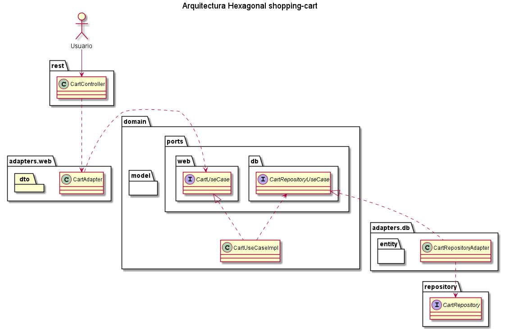

# shopping-cart
Ejemplo arquitectura hexagonal. SpringBoot

Aplicación de comercio electrónico. La aplicación proporciona dos casos de uso diferentes:

## Open Api

http://localhost:8080/swagger-ui/index.html

## Consola H2

http://localhost:8080/h2-console/

jdbc:h2:mem:shoppingcart-java

## CRUD de productos

Los productos tienen los siguientes datos:

* Marca
* Nombre
* Stock (cantidad de producto disponible)

API REST Product:

* GET /api/products - Muestra los productos
* POST /api/products - Añade un producto
* PUT /api/products/:id/stock/:quantity – Modifica el stock de un producto
* GET /api/products/:id - Muestra un producto en específico
* DELETE /api/products/:id - Borra un producto en específico

## Gestión del carrito de la compra

* Añadir productos al carrito
* Eliminar productos del carrito
* Eliminar el carrito
* Finalizar el carrito. Cuando se finaliza el carrito, la aplicación debe validar el carrito, porque puede haber productos que ya no están disponibles. Para ello, se debe implementar un servicio que realice esta validación comprobando que hay stock disponible y actualizando el stock de los productos.

API REST shoppingcarts:

* POST /api/shoppingcarts - Crea un carrito de compra
* PATCH /api/shoppingcarts/:id - Modifica el carrito de compra para pasar el estado a completo (finalizar el carrito)
* GET /api/shoppingcarts/:id - Obtiene un carrito de compra específico
* DELETE /api/shoppingcarts/:id - Borra un carrito de compra específico
* POST /api/shoppingcarts/:cart_id/product/:prod_id/quantity/:prod_quantity - Añade un producto al carrito de compra, en la cantidad indicada por :prod_quantity. Si ya existiera lo modifica con la nueva cantidad. Debe validar que hay suficiente stock.
* DELETE /api/shoppingcarts/:cart_id/product/:prod_id - Borra un producto específico de un carrito de compra

https://bootify.io/app/X11EHHCRQCVS